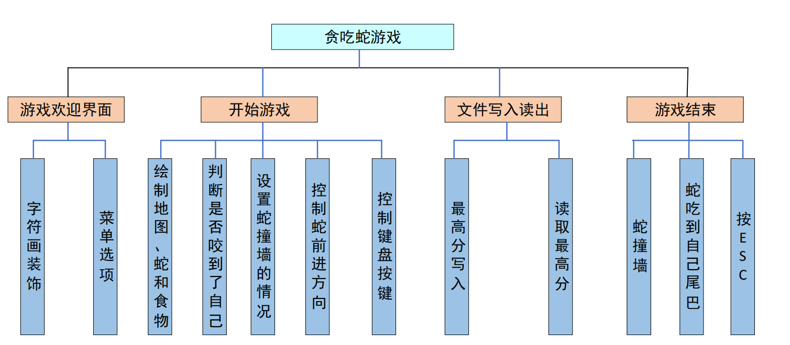

这次，在老师的安排下，我和小组成员一起做了一个贪吃蛇游戏，依照老师的要求，实现了游戏欢迎界面、游戏主窗体、游戏说明界面和游戏结束界面。具体如下图所示：

贪吃蛇最初为人们所知的是诺基亚手机附带的一个小游戏，它伴随着诺基亚手机走向世界。现在的贪吃蛇出现了许多衍生版本，并被移植到各种平台上。

这是我们的游戏欢迎界面:

<video src='./image/WeChat_20250209151646.mp4'>
</video>

以下我们的游戏界面。玩家可以通过控制上下左右操控贪吃蛇的前进方向。同时随着贪吃蛇越吃越多，贪吃蛇的长度越来越大，移动的速度也越来越快，难度不断增大。

左下角是您现在的分数。右下角是您的历史最高分，可以在主界面查看。

<video src='image/WeChat_20250209151658.mp4>
</video>

我们还准备了游戏说明，您可以通过按键2进行查阅。

<video src='image/WeChat_20250209151716.mp4>
</video>

ps：我们用的是visual Studio进行开发，如果您感兴趣，可以下载代码直接运行。同时，我们还上传了详细的报告，里面有关于每个代码的分析以及设计的思路。我们上传的代码也进行了详细的复制，通俗易懂。如果我们的项目对您有帮助，请给我们一个星星吧！谢谢！

